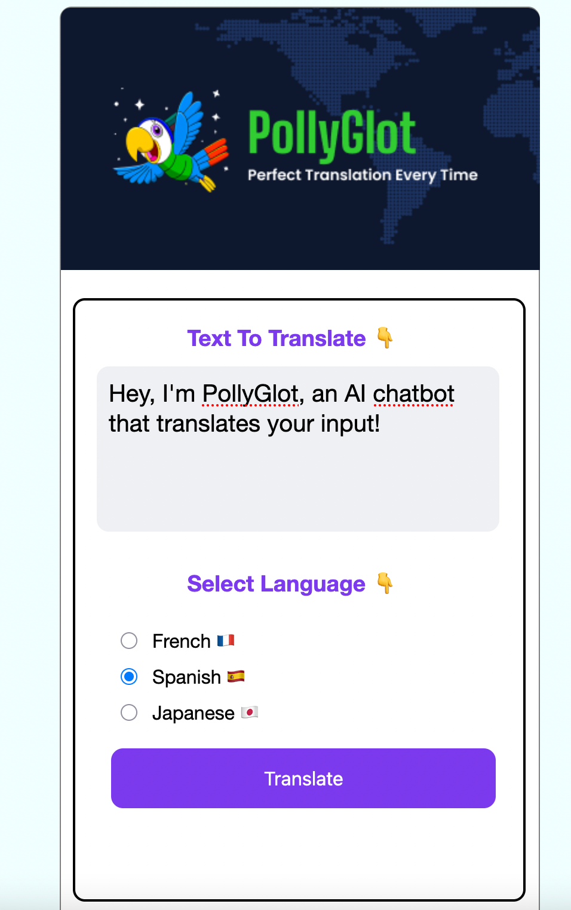
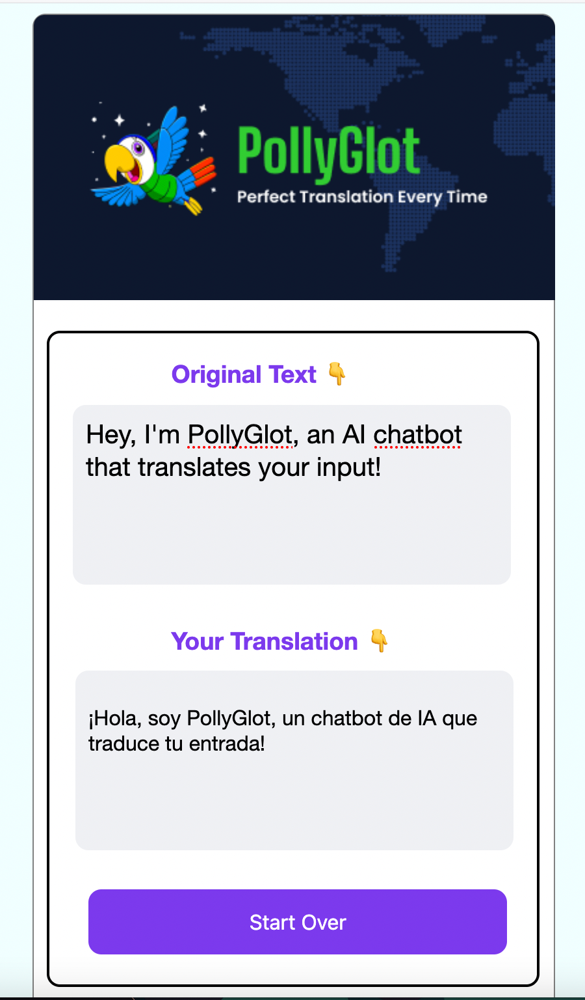

### Pollyglot
An OpenAI powered chatbot that translate user input in 3 languages.
Originally built in HTML, CSS, and vanilla JS. Updated to a small Node server to handle environment variables. This was an assignment from the [Scrimba AI Engineering course](https://scrimba.com/the-ai-engineer-path-c02v).

### Figma
Find the [Figma](https://www.figma.com/design/5zQQiaSDdUu8AqVGlg9PZ3/OpenAi-API---PollyGlot?node-id=1-168&t=KHxtYVDkkR4plj08-0) 
for this project here.

### To Run
You will need an API Key from OpenAI in order to receive any translations. 
Search the repository for `const OPENAI_API_KEY` in `index.js`, and place your key there. The app is built in pure HTML,
CSS, and JS, so your IDE should be able to open your html page in your chosen browser.
